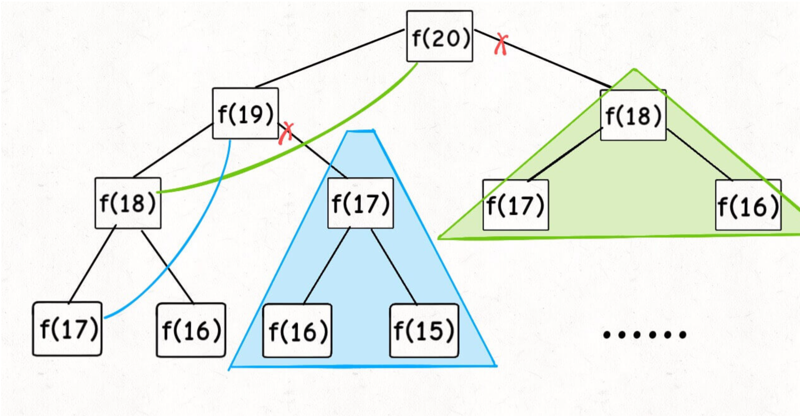
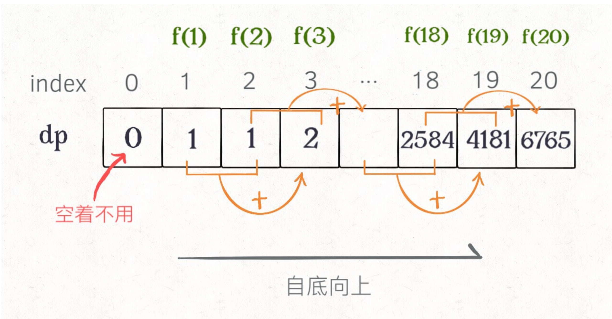

# 题目

写一个函数，输入 n ，求斐波那契（Fibonacci）数列的第 n 项（即 F(N)）。斐波那契数列的定义如下：

```()
F(0) = 0,   F(1) = 1
F(N) = F(N - 1) + F(N - 2), 其中 N > 1.
```

斐波那契数列由 0 和 1 开始，之后的斐波那契数就是由之前的两数相加而得出。

答案需要取模 1e9+7（1000000007），如计算初始结果为：1000000008，请返回 1。

## 思考

这道题当然可以使用简单递归的形式求解,但会曲解题意(时间复杂度为 O(2^n)),可以考虑动态规划求解

```(leetCode方式)
var fib = (n) => {
  let n1 = 0,n2 = 1,sum;

  // 自底向上
  for(i = 0;i < n;i++){
    sum = (n1+n2)%1000000007;
    n1 = n2;
    n2 = sum;// 备忘录减少计算量
  }

  return n1;
}
```

而动态规划之所以与递归不同,是由于对于重叠子问题,不是简单的叠加计算,而是可以通过例如 **备忘录** 等方法,去减少重复计算即可;

```(自定义写法)
var fib = function(n) {
    if(n < 2) return n;

    // 备忘录方法，对已经计算过的值进行记忆
    var memo = {};

    return helper(memo,n);
};

function helper(memo,n){
    if(n == 1 || n == 2) return 1;

    if(memo[n]) return memo[n];

    // sum，实际上是把可能存在递归树的子节点的值提前保留下来，避免重复计算
    memo[n] = (helper(memo,n-1) + helper(memo,n-2)) % 1000000007;
    return memo[n];
}
```

而这种方法还是递归,只是做了存储,那时间复杂度怎么计算?
就是用子问题个数乘以解决一个子问题需要的时间

这道题子问题个数是 O(n)
而时间上甚至不需要循环,所以时间为 O(1);
综上一共就是 O(n)

这种方式叫做自顶向下:
从上往下延伸,都是从一个规模较大的原问题比如`f(20)`,向下逐渐分解规模,直到`f(1)`和`f(2)`这两个base case,然后逐层返回答案,这就叫做[自顶向下]

反过来[自底向上],就是从问题规模最小的`f(1)`和`f(2)`开始往上推,直到推到我们想要的答案`f(20)`,这就是下面介绍的动态规划的思路.



### dp数组的迭代解法

我们可以把这个[备忘录]独立出来一张表,在其上做[自底向上]的推算即可



也就是上面的动态规划解法.

上面的方法中

```()
n1 = n2;
n2 = sum;
```

实际上是[状态压缩]的技巧,也就是只需要存储表中的一部分数据,而不是存储之前的所有数据

两种解法其实是差不多的，大部分情况下，效率也基本相同。

## 总结

所以只要推导出状态转移公式,再排除默认状态进行穷举即可,不管是自顶向下还是自底向上都是方法而已
