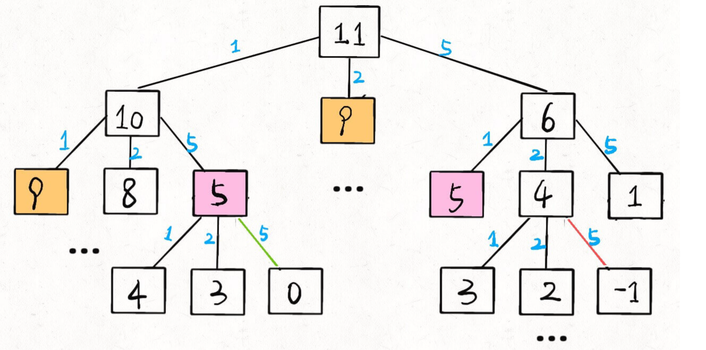

# 题目

给你 k 种面值的硬币，面值分别为 c1, c2 ... ck，每种硬币的数量无限，再给一个总金额 amount，问你最少需要几枚硬币凑出这个金额，如果不可能凑出，算法返回 -1;

```()
示例 1：

输入：coins = [1, 2, 5], amount = 11
输出：3 
解释：11 = 5 + 5 + 1
```

## 思考

### 暴力破解

首先这里符合最优子结构,没有对硬币数量进行限制

比如你想求 amount = 11 时的最少硬币数（原问题），如果你知道凑出 amount = 10 的最少硬币数（子问题），你只需要把子问题的答案加一（再选一枚面值为 1 的硬币）就是原问题的答案

然后思考如何列出正确的状态转移方程?

1. **确认base case**,当amount为0时,返回0即可.
2. **确认状态**,也就是原问题和子问题中会变化的变量.由于硬币数量无限,硬币的面额也是题目给定的,只有目标金额会不断地向base case靠近,所以唯一的状态就是目标金额`amount`,也就是定值
3. **确定选择**,也就是导致状态产生变化的行为.在选择硬币时,会相应的减少目标金额
4. **明确dp函数/数组的定义**,我们这里讲的是自顶向下的解法,所以会有一个递归的dp函数,一般来说函数的参数就是状态转移中会变化的量,也就是上面说到的状态;函数的返回值就是题目要求我们计算的量,所以可以进行如下定义:

```()
dp(n)的定义:输入一个目标金额n,返回凑出目标金额n的最少硬币数量
```

由此可以写出第一版根据状态转移方程变成的代码:

```()
var coinChange = function(coins, amount) {
    function dp(n){
        if(n === 0 ) return 0;
        if(n < 0) return -1;

        // 初始值设一个相对最大值
        let res = Number.MAX_SAFE_INTEGER;

        for(let coin in coins){
            subAmount = dp(n - coins[coin]);

            if(subAmount == -1) continue;

            // 这里返回个数，+1的意思是不管结果是什么，最终都需要加上一个最小面额的硬币
            res = Math.min(res,1+subAmount);
        }

        return res === Number.MAX_SAFE_INTEGER ? -1 : res ;
    }

    return dp(amount);
};
```

但测试时会超时,所以这里需要进行优化,使用[备忘录]来进行剪枝

比如 amount = 11, coins = {1,2,5} 时画出递归树看看：

;

递归算法的时间复杂度分析：子问题总数 x 每个子问题的时间。

子问题总数为递归树节点个数，这个比较难看出来，是 O(n^k)，总之是指数级别的。每个子问题中含有一个 for 循环，复杂度为 O(k)。所以总时间复杂度为 O(k * n^k)，指数级别。

### 加上[备忘录]

```()
var coinChange = function(coins, amount) {
    let memo = {};

    function dp(n){
        if(n === 0 ) return 0;
        if(n < 0) return -1;

        if(memo[n]) return memo[n];

        // 初始值设一个相对最大值
        let res = Number.MAX_SAFE_INTEGER;

        for(let coin in coins){
            subAmount = dp(n - coins[coin]);

            if(subAmount == -1) continue;

            // 这里返回个数，+1的意思是不管结果是什么，最终都需要加上一个最小面额的硬币
            res = Math.min(res,1+subAmount);
        }

        memo[n] = res === Number.MAX_SAFE_INTEGER ? -1 : res ;

        return memo[n];
    }

    return dp(amount);
};
```

如上所示,子问题总数不会超过金额数 n，即子问题数目为 O(n)。处理一个子问题的时间不变，仍是 O(k)，所以总的时间复杂度是 O(kn)。

### dp数组的迭代解法

我们也可以使用自底向上的方法来消除重叠子问题,关于[状态][选择]和**base case**与之前没有区别,dp数组的定义和刚才dp函数类似,也是把「状态」，也就是目标金额作为变量。不过 dp 函数体现在函数参数，而 dp 数组体现在数组索引：

> dp数组的定义:当目标金额为i时,至少需要dp[i]枚硬币凑出.

```(dp解法)
var coinChange = function(coins, amount) {
    let dp = Array(amount+1).fill(amount+1);
    dp[0] = 0;
    // 这里其实从0开始，计算每种结果至少需要dp[i]枚硬币，自底向上
    for(let i = 0;i < amount+1; i++){
        for(let coin in coins){
            // 子问题无解
            if(i - coins[coin] < 0) continue;
            dp[i] = Math.min(dp[i],1 + dp[i - coins[coin]]);
        }
    }
    // 实际上还是需要获取最小值
    return dp[amount] == amount + 1 ? -1 :dp[amount];
};
```

