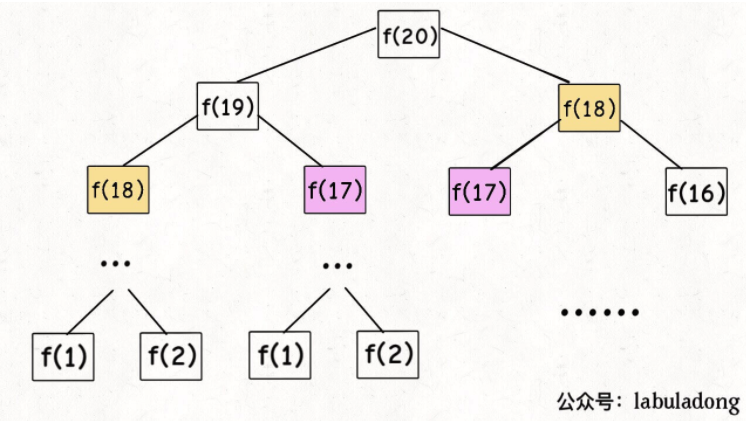
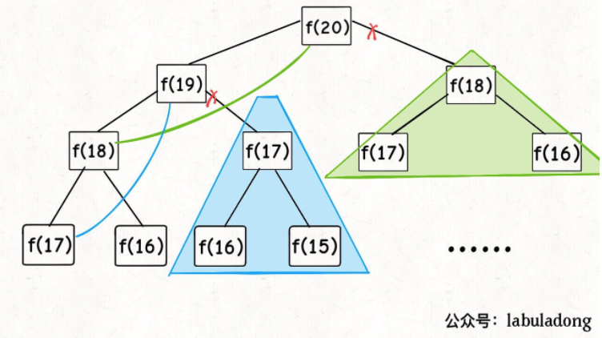
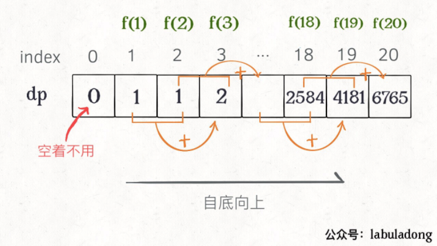
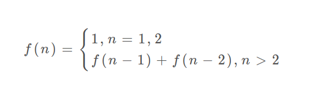

# 正文

> 读完之后可以去自己尝试 [斐波那契树](https://leetcode-cn.com/problems/fibonacci-number/)以及 [二分查找详解](https://leetcode-cn.com/problems/coin-change/)

首先,动态规划问题的一般形式就是求最值.动态规划其实是运筹学的一种最优化方法,只不过在计算机问题上应用比较多,比如说让你求最长递增子序列呀,最小编辑距离呀等等.
求解动态规划的核心问题是穷举,因为要求最值,肯定要把所有可行的答案穷举出来,然后在其中找最值.

动态规划的穷举有点特别,因为这类问题存在 [重叠子问题],如果暴力穷举的话效率会极其低下,所以需要 [备忘录] 或者 [DP table] 来优化穷举过程,避免不必要的计算.

而且,动态规划问题一定会具备[最优子结构],才能通过子问题的最值得到原问题的最值.

另外,虽然动态规划的核心思想就是穷举求最值,但是问题可以千变万化,穷举所有可行解其实并不是一件容易的事,只有列出正确的[状态转移方程]才能正确地穷举.

以上提到的**重叠子问题**、**最优子结构**、**状态转移方程**就是动态规划三要素.

下面是可供参考的思维框架:

```()
明确 base case -> 明确 [状态] -> 明确 [选择] -> 定义 dp数组/函数的含义
```

按上面的套路走,最后的结果就可以套这个框架:

```()
# 初始化 base case
dp[0][0][...] = base
# 进行状态转移
for 状态1 in 状态1的所有取值：
    for 状态2 in 状态2的所有取值：
        for ...
            dp[状态1][状态2][...] = 求最值(选择1，选择2...)
```

下面通过斐波那契数列问题和凑零钱问题来详解动态规划的基本原理.

## 斐波那契数列

写一个函数，输入 n ，求斐波那契（Fibonacci）数列的第 n 项。斐波那契数列的定义如下：

```(题目)
F(0) = 0,   F(1) = 1
F(N) = F(N - 1) + F(N - 2), 其中 N > 1.
斐波那契数列由 0 和 1 开始，之后的斐波那契数就是由之前的两数相加而得出。
```

### 1.暴力递归

斐波那契数列的数学形式就是递归的，写成代码就是这样：

```()
int fib(int N) {
    if (N == 1 || N == 2) return 1;
    return fib(N - 1) + fib(N - 2);
}
```



(PS: 但凡遇到需要递归的问题,最好都画出递归树,这对你分析算法的复杂度,寻找算法低效的原因都有巨大帮助)

这个递归树怎么理解？就是说想要计算原问题 f(20)，我就得先计算出子问题 f(19) 和 f(18)，然后要计算 f(19)，我就要先算出子问题 f(18) 和 f(17)，以此类推。最后遇到 f(1) 或者 f(2) 的时候，结果已知，就能直接返回结果，递归树不再向下生长了。

观察递归树，很明显发现了算法低效的原因：存在大量重复计算，比如 f(18) 被计算了两次，而且你可以看到，以 f(18) 为根的这个递归树体量巨大，多算一遍，会耗费巨大的时间。更何况，还不止 f(18) 这一个节点被重复计算，所以这个算法及其低效。

这就是动态规划问题的第一个性质：重叠子问题.

### 2.带备忘录的递归解法

明确了问题,其实就已经把问题解决了一半.既然耗时的原因是重复计算,那么可以造一个[备忘录],每次算出某个子问题的答案后别急着返回,先记到[备忘录]里再返回;每次遇到一个子问题先去[备忘录]里查一查,如果发现之前已经解决过这个问题了,直接把答案拿出来用,不要再耗时去计算了.

一般使用一个数组充当这个[备忘录],当然你也可以使用哈希表(字典),思想都是一样的.

```()
int fib(int N) {
    if (N < 1) return 0;
    // 备忘录全初始化为 0
    vector<int> memo(N + 1, 0);
    // 进行带备忘录的递归
    return helper(memo, N);
}

int helper(vector<int>& memo, int n) {
    // base case
    if (n == 1 || n == 2) return 1;
    // 已经计算过
    if (memo[n] != 0) return memo[n];
    memo[n] = helper(memo, n - 1) + helper(memo, n - 2);
    return memo[n];
}
```

现在,画出递归树,你就知道[备忘录]到底做了什么.



实际上,带[备忘录]的递归算法,把一颗存在巨量冗余的递归树通过 **[剪枝]**,改造成了一幅不存在冗余的递归图,极大减少了子问题的个数.
也就是通过一个存储空间记忆之前的计算结果,当有重复计算的就直接返回即可.

### 3.dp数组的迭代解法

```()
int fib(int N) {
    if (N < 1) return 0;
    if (N == 1 || N == 2) return 1;
    vector<int> dp(N + 1, 0);
    // base case
    dp[1] = dp[2] = 1;
    for (int i = 3; i <= N; i++)
        dp[i] = dp[i - 1] + dp[i - 2];
    return dp[N];
}
```



这两种其实思想是差不多的

这里，引出「状态转移方程」这个名词，实际上就是描述问题结构的数学形式：



你把 `f(n)` 想做一个状态 `n`,这个状态 `n` 是由状态 `n-1` 和状态 `n-2`相加转移而来,这就叫状态转移,仅此而已.

你会发现,上面的几种解法中的所有操作,例如 `return f(n-1) + f(n-2)`, `dp[i]=dp[i-1] + dp[i-2]`,以及对备忘录或 DP table 的初始化操作,都是围绕这个方程式的不同表现形式.可见列出[状态转移方程]的重要性,它是解决问题的核心.而且很容易发现,其实状态转移方程直接代表着暴力解法.

**千万不要看不起暴力解,动态规划问题最困难的就是写出这个暴力解,即状态转移方程.只要写出暴力解,优化方法无非是用备忘录或者 DP table,再无奥妙可言.**

#### 细节优化

根据斐波那契数列的状态转移方程,当前状态只和之前的两个状态有关,其实并不需要那么长的一个 DP table 来存储所有的状态,只要想办法存储之前的两个状态就行了.所以,可以进一步优化,把空间复杂度降为 O(1):

```()
int fib(int n) {
    if (n < 1) return 0;
    if (n == 2 || n == 1)
        return 1;
    int prev = 1, curr = 1;
    for (int i = 3; i <= n; i++) {
        int sum = prev + curr;
        prev = curr;
        curr = sum;
    }
    return curr;
}
```

这里是[状态压缩],听上去高大上一点,实际是因为斐波那契数列只需要记忆两个之前的状态,也就是二叉树的子节点即可,而不需要记录其他节点,反正最后都只返回一个对应位置即可.

## 凑零钱问题

题目:给你 k 种面值的硬币，面值分别为 c1, c2 ... ck，每种硬币的数量无限，再给一个总金额 amount，问你最少需要几枚硬币凑出这个金额，如果不可能凑出，算法返回 -1 。算法的函数签名如下：

```()
// coins 中是可选硬币面值，amount 是目标金额
int coinChange(int[] coins, int amount);
```

比如说 k = 3，面值分别为 1，2，5，总金额 amount = 11。那么最少需要 3 枚硬币凑出，即 11 = 5 + 5 + 1。
你认为计算机应该如何解决这个问题？显然，就是把所有可能的凑硬币方法都穷举出来，然后找找看最少需要多少枚硬币。

## 最长公共子序列

给定两个字符串 text1 和 text2，返回这两个字符串的最长 公共子序列 的长度。如果不存在 公共子序列 ，返回 0 。

```()
示例 1：

输入：text1 = "abcde", text2 = "ace" 
输出：3  
解释：最长公共子序列是 "ace" ，它的长度为 3 。

示例 2：

输入：text1 = "abc", text2 = "abc"
输出：3
解释：最长公共子序列是 "abc" ，它的长度为 3 。

示例 3：

输入：text1 = "abc", text2 = "def"
输出：0
解释：两个字符串没有公共子序列，返回 0 。
```

### 递归 dp 函数

```()
var longestCommonSubsequence = function (text1, text2) {
    this.dp = function (i, j) {
        // 递归结束条件，有一个字符串为空字符串
        if (i === -1 || j === -1) {
            return 0;
        }
        // 相等即找到一个LCS的字符，加1后继续向前查找,这里是一直都会加1的
        if (text1[i] === text2[j]) {
            return this.dp(i - 1, j - 1) + 1;
        } else {
            // 没有找到LCS字符，则判断是移动哪个指针能使LCS更长
            return Math.max(
                this.dp(i - 1, j), // text1[i]不在LCS中，text2[j]在LCS中
                this.dp(i, j - 1), // text2[j]不在LCS中，text1[i]在LCS中
                this.dp(i - 1, j - 1) // text1[i]和text[2]都不在LCS中
            );
        }
    }
    // 两个指针i和j，分别指向字符串的最后一位，从后往前遍历
    return this.dp(text1.length - 1, text2.length - 1);
};
```

## 字符串的删除操作

给定两个单词 word1 和 word2，找到使得 word1 和 word2 相同所需的最小步数，每步可以删除任意一个字符串中的一个字符。

```()
示例：

输入: "sea", "eat"
输出: 2
解释: 第一步将"sea"变为"ea"，第二步将"eat"变为"ea"
```

也因此,只要调用求最长子序列的长度,然后依次减去最长子序列的长度,就是最终的结果

```()
var minDistance = function(word1, word2) {
    let m = word1.length,n = word2.length;

    let lcs = longestCommonSubsequence(word1,word2);
    return m - lcs + n - lcs;
};

var longestCommonSubsequence = function (text1, text2) {
    this.dp = function (i, j) {
        // 递归结束条件，有一个字符串为空字符串
        if (i === -1 || j === -1) {
            return 0;
        }
        // 相等即找到一个LCS的字符，加1后继续向前查找,这里是一直都会加1的
        if (text1[i] === text2[j]) {
            return this.dp(i - 1, j - 1) + 1;
        } else {
            // 没有找到LCS字符，则判断是移动哪个指针能使LCS更长
            return Math.max(
                this.dp(i - 1, j), // text1[i]不在LCS中，text2[j]在LCS中
                this.dp(i, j - 1), // text2[j]不在LCS中，text1[i]在LCS中
                this.dp(i - 1, j - 1) // text1[i]和text[2]都不在LCS中
            );
        }
    }
    // 两个指针i和j，分别指向字符串的最后一位，从后往前遍历
    return this.dp(text1.length - 1, text2.length - 1);
};
```
