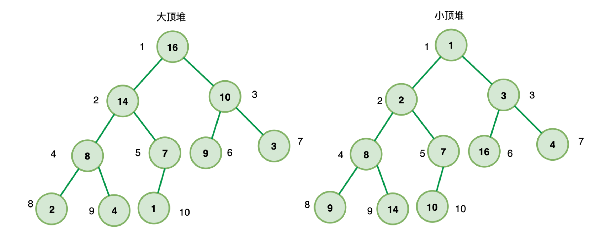

# 正文

> 这里的快速选择算法与快速排序颇有渊源,在学习排序算法时,我们接触过选择排序算法,这里就来重新学习下

## 数组中的第K个最大元素

```()
给定整数数组 nums 和整数 k，请返回数组中第 k 个最大的元素。

请注意，你需要找的是数组排序后的第 k 个最大的元素，而不是第 k 个不同的元素。


示例 1:

输入: [3,2,1,5,6,4] 和 k = 2
输出: 5
示例 2:

输入: [3,2,3,1,2,4,5,5,6] 和 k = 4
输出: 4
```

按题目来说,如果可以使用快速排序,很快速的就可以得到一个排序之后的数组,从而快速得到答案,但快排时间复杂度是`O(NlogN)`,其中`N`表示数组的长度.

```()
/* 解法一：数组排序，取第 k 个数
最简单

代码实现：*/

let findKthLargest = function(nums, k) {
    nums.sort((a, b) => b - a).slice(0, k);
    return nums[k-1]
};
```

但这样复杂度是挺高的,且就想要第K大的元素,却给整个数组排序,这种问题有两种解法,一种是二叉堆(优先队列)的解法,另一种就是标题说到的快速选择算法(quick select)

### 二叉堆

这里当然应该用小顶堆

满足下面两个条件的就是堆：

堆是一个完全二叉树
堆上的任意节点值都必须大于等于（大顶堆）或小于等于（小顶堆）其左右子节点值
如果堆上的任意节点都大于等于子节点值，则称为 大顶堆

如果堆上的任意节点都小于等于子节点值，则称为 小顶堆

也就是说，在大顶堆中，根节点是堆中最大的元素；

在小顶堆中，根节点是堆中最小的元素；



可以直接使用数组存储法存储：

简单来说： 堆其实可以用一个数组表示，给定一个节点的下标 i （i从1开始） ，那么它的父节点一定为 A[i/2] ，左子节点为 A[2i] ，右子节点为 A[2i+1]

原地建堆,代码表示

```()
// 原地建堆
function buildHeap(items, heapSize) {
    while(heapSize < items.length - 1) {
        heapSize ++
        heapify(items, heapSize)
    }
}

function heapify(items, i) {
    // 自下而上式堆化
    while (Math.floor(i/2) > 0 && items[i] < items[Math.floor(i/2)]) {  
        swap(items, i, Math.floor(i/2)); // 交换 
        i = Math.floor(i/2); 
    }
}  

function swap(items, i, j) {
    let temp = items[i]
    items[i] = items[j]
    items[j] = temp
}

// 测试
var items = [,5, 2, 3, 4, 1]
// 初始有效序列长度为 1
buildHeap(items, 1)
console.log(items)
// [empty, 1, 2, 3, 5, 4]
```

#### 代码表示

```()
/**
 * @param {number[]} nums
 * @param {number} k
 * @return {number}
 */
 // 整个流程就是上浮下沉
var findKthLargest = function(nums, k) {
   let heapSize=nums.length
    buildMaxHeap(nums,heapSize) // 构建好了一个大顶堆
    // 进行下沉 大顶堆是最大元素下沉到末尾
    for(let i=nums.length-1;i>=nums.length-k+1;i--){
        swap(nums,0,i);
        --heapSize; // 下沉后的元素不参与到大顶堆的调整
        // 重新调整大顶堆
        maxHeapify(nums, 0, heapSize);
    }
    return nums[0]
   // 自下而上构建一颗大顶堆
   function buildMaxHeap(nums,heapSize){
     for(let i=Math.floor(heapSize/2)-1;i>=0;i--){
        maxHeapify(nums,i,heapSize)
     }
   }
   // 从左向右，自上而下的调整节点
   function maxHeapify(nums,i,heapSize){
       let l=i*2+1
       let r=i*2+2
       let largest=i
       if(l < heapSize && nums[l] > nums[largest]){
           largest=l
       }
       if(r < heapSize && nums[r] > nums[largest]){
           largest=r
       }
       if(largest!==i){
           swap(nums,i,largest) // 进行节点调整
           // 继续调整下面的非叶子节点
           maxHeapify(nums,largest,heapSize)
       }
   }
   function swap(a,  i,  j){
        let temp = a[i];
        a[i] = a[j];
        a[j] = temp;
   }
};
```

### 快速选择算法

```()
let findKthLargest = function(nums, k) {
    return quickSelect(nums, nums.length - k)
};

let quickSelect = (arr, k) => {
  return quick(arr, 0 , arr.length - 1, k)
}

let quick = (arr, left, right, k) => {
  let index
  if(left < right) {
    // 划分数组
    index = partition(arr, left, right)
    // Top k
    if(k === index) {
        return arr[index]
    } else if(k < index) {
        // Top k 在左边
        return quick(arr, left, index-1, k)
    } else {
        // Top k 在右边
        return quick(arr, index+1, right, k)
    }
  }
  return arr[left]
}

let partition = (arr, left, right) => {
  // 取中间项为基准
  var datum = arr[Math.floor(Math.random() * (right - left + 1)) + left],
      i = left,
      j = right
  // 开始调整
  while(i < j) {
    
    // 左指针右移
    while(arr[i] < datum) {
      i++
    }
    
    // 右指针左移
    while(arr[j] > datum) {
      j--
    }
    
    // 交换
    if(i < j) swap(arr, i, j)

    // 当数组中存在重复数据时，即都为datum，但位置不同
    // 继续递增i，防止死循环
    if(arr[i] === arr[j] && i !== j) {
        i++
    }
  }
  return i
}

// 交换
let swap = (arr, i , j) => {
    let temp = arr[i]
    arr[i] = arr[j]
    arr[j] = temp
}
```

其实是在快速排序中插入查找是否有正好和k位置一致的元素,这样直接返回即可.这里的重点是`partition`.