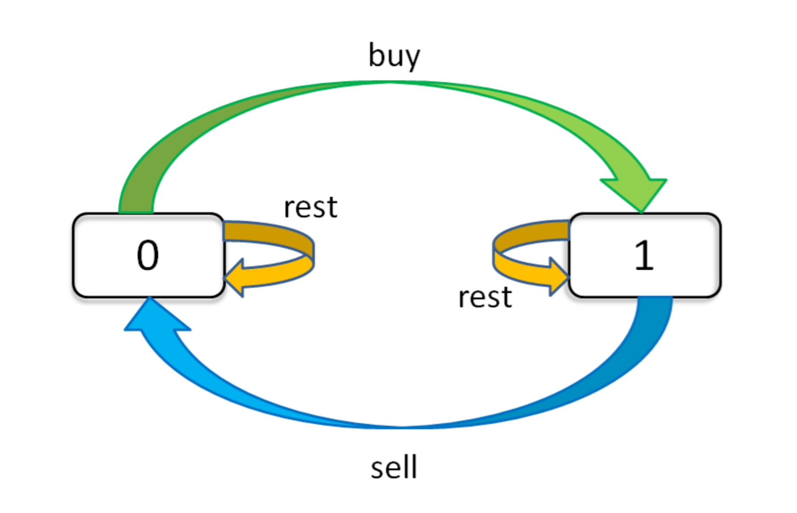

# 正文

> 股票买卖属于动态规划，之前也练习过最简单的股票买卖，而这里采用状态机简化这一问题.

## 第四道题，也是所有的基础

给定一个整数数组  prices ，它的第 i 个元素  prices[i] 是一支给定的股票在第 i 天的价格。

设计一个算法来计算你所能获取的最大利润。你最多可以完成 k 笔交易。

注意：你不能同时参与多笔交易（你必须在再次购买前出售掉之前的股票）。

```()
示例 1：

输入：k = 2, prices = [2,4,1]
输出：2
解释：在第 1 天 (股票价格 = 2) 的时候买入，在第 2 天 (股票价格 = 4) 的时候卖出，这笔交易所能获得利润 = 4-2 = 2 。
```

### 解析

首先这里因为有个限制，最多可以完成 k 笔交易，与之前不同。

可以利用【状态】进行穷举（自底向上）

这个问题的「状态」有三个，第一个是天数，第二个是允许交易的最大次数，第三个是当前的持有状态（即之前说的 rest 的状态，我们不妨用 1 表示持有，0 表示没有持有）。然后我们用一个三维数组就可以装下这几种状态的全部组合：

```()
dp[i][k][0 or 1]
0 <= i <= n-1, 1 <= k <= K
n 为天数，大 K 为最多交易数
此问题共 n × K × 2 种状态，全部穷举就能搞定。

for 0 <= i < n:
    for 1 <= k <= K:
        for s in {0, 1}:
            dp[i][k][s] = max(buy, sell, rest)
```

而且我们可以用自然语言描述出每一个状态的含义，比如说 dp[3][2][1] 的含义就是：今天是第三天，我现在手上持有着股票，至今最多进行 2 次交易。再比如 dp[2][3][0] 的含义：今天是第二天，我现在手上没有持有股票，至今最多进行 3 次交易。很容易理解，对吧？

我们想求的最终答案是 dp[n - 1][k][0]，即最后一天，最多允许 K 次交易，最多获得多少利润

这里实际上是一个自底向上的推导,类似斐波那契数列以及青蛙跳台阶的累计计算

### 状态转移框架

现在，我们完成了「状态」的穷举，我们开始思考每种「状态」有哪些「选择」，应该如何更新「状态」。只看「持有状态」，可以画个状态转移图。

;

我们来写一下状态转移方程：

```()
dp[i][k][0] = max(dp[i-1][k][0], dp[i-1][k][1] + prices[i])
              max(   选择 rest  ,             选择 sell      )

解释：今天我没有持有股票，有两种可能：
要么是我昨天就没有持有，然后今天选择 rest，所以我今天还是没有持有；
要么是我昨天持有股票，但是今天我 sell 了，所以我今天没有持有股票了。

dp[i][k][1] = max(dp[i-1][k][1], dp[i-1][k-1][0] - prices[i])
              max(   选择 rest  ,           选择 buy         )

解释：今天我持有着股票，有两种可能：
要么我昨天就持有着股票，然后今天选择 rest，所以我今天还持有着股票；
要么我昨天本没有持有，但今天我选择 buy，所以今天我就持有股票了。
```

不过还差最后一点点，就是定义 base case，即最简单的情况。

```()
dp[-1][k][0] = 0
解释：因为 i 是从 0 开始的，所以 i = -1 意味着还没有开始，这时候的利润当然是 0 。
dp[-1][k][1] = -infinity
解释：还没开始的时候，是不可能持有股票的，用负无穷表示这种不可能。
dp[i][0][0] = 0
解释：因为 k 是从 1 开始的，所以 k = 0 意味着根本不允许交易，这时候利润当然是 0 。
dp[i][0][1] = -infinity
解释：不允许交易的情况下，是不可能持有股票的，用负无穷表示这种不可能。
```

### 第一题解法为：

给定一个数组 prices ，它的第  i 个元素  prices[i] 表示一支给定股票第 i 天的价格。

你只能选择 某一天 买入这只股票，并选择在 未来的某一个不同的日子 卖出该股票。设计一个算法来计算你所能获取的最大利润。

返回你可以从这笔交易中获取的最大利润。如果你不能获取任何利润，返回 0 。

```()
dp[i][1][0] = max(dp[i-1][1][0], dp[i-1][1][1] + prices[i])
dp[i][1][1] = max(dp[i-1][1][1], dp[i-1][0][0] - prices[i])
            = max(dp[i-1][1][1], -prices[i])
解释：k = 0 的 base case，所以 dp[i-1][0][0] = 0。

现在发现 k 都是 1，不会改变，即 k 对状态转移已经没有影响了。
可以进行进一步化简去掉所有 k：
dp[i][0] = max(dp[i-1][0], dp[i-1][1] + prices[i])
dp[i][1] = max(dp[i-1][1], -prices[i])
```

这里实际上 k 为 1，代码为；

```()
// k == 1
var maxProfit = function(prices) {
    let len = prices.length;

    let dp = new Array(len).fill([]);

    for (let i = 0; i < len; i++) {
        // 从第二天开始计算
        if (i - 1 == -1) {
            dp[i][0] = 0;
            dp[i][1] = -prices[i];
            continue;
        }

        dp[i][0] = Math.max(dp[i-1][0], dp[i-1][1] + prices[i]);
        dp[i][1] = Math.max(dp[i-1][1], -prices[i]);
    }


    return dp[len - 1][0];
};
```

所以是把每一天的利润算出来了，而且也是从第二天才开始计算的，特意对第一天做了处理

### 第二题：k 为正无穷

给定一个数组 prices ，其中  prices[i] 是一支给定股票第 i 天的价格。

设计一个算法来计算你所能获取的最大利润。**你可以尽可能地完成更多的交易（多次买卖一支股票）。**

注意：你不能同时参与多笔交易（你必须在再次购买前出售掉之前的股票）。

#### 如果 k 为正无穷，那么就可以认为 k 和 k - 1 是一样的。可以这样改写框架：

```()
dp[i][k][0] = max(dp[i-1][k][0], dp[i-1][k][1] + prices[i])
dp[i][k][1] = max(dp[i-1][k][1], dp[i-1][k-1][0] - prices[i])
            = max(dp[i-1][k][1], dp[i-1][k][0] - prices[i])

我们发现数组中的 k 已经不会改变了，也就是说不需要记录 k 这个状态了：
dp[i][0] = max(dp[i-1][0], dp[i-1][1] + prices[i])
dp[i][1] = max(dp[i-1][1], dp[i-1][0] - prices[i])
```

代码为：

```()
// k == 正无穷
var maxProfit = function(prices) {
    let len = prices.length;

    let dp = new Array(len).fill([]);

    for (let i = 0; i < len; i++) {
        // 从第二天开始计算
        if (i - 1 == -1) {
            dp[i][0] = 0;
            dp[i][1] = -prices[i];
            continue;
        }
        let temp = dp[i][0];
        // 这里需要修改，因为i-1可能为-1
        dp[i][0] = Math.max(dp[i-1][0], dp[i-1][1] + prices[i]);
        dp[i][1] = Math.max(dp[i-1][1], temp-prices[i]);
    }


    return dp[len-1][0];
};
```

### 第三题：k 为 2

给定一个数组，它的第 i 个元素是一支给定的股票在第 i 天的价格。

设计一个算法来计算你所能获取的最大利润。你最多可以完成   两笔   交易。

注意：你不能同时参与多笔交易（你必须在再次购买前出售掉之前的股票）。

这里 k 为 2

```()
原始的动态转移方程，没有可化简的地方
dp[i][k][0] = max(dp[i-1][k][0], dp[i-1][k][1] + prices[i])
dp[i][k][1] = max(dp[i-1][k][1], dp[i-1][k-1][0] - prices[i])
```

这里和上面不太一样，要考虑 k 的情况了，由于没有消掉 k 的影响，所以必须要对 k 进行穷举：

```()
// k=2
var maxProfit = function(prices) {
    const n = prices.length;
    let buy1 = -prices[0], buy2 = -prices[0];
    let sell1 = 0, sell2 = 0;
    for (let i = 1; i < n; i++) {
        buy1 = Math.max(buy1, -prices[i]);
        sell1 = Math.max(sell1, buy1 + prices[i]);
        buy2 = Math.max(buy2, sell1 - prices[i]);
        sell2 = Math.max(sell2, buy2 + prices[i]);
    }
    return sell2;
};
```

暂时只能按枚举的方式来记忆了。